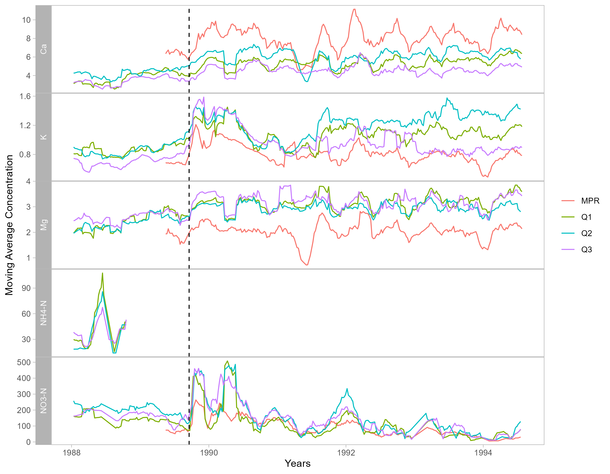

# Hurricane Disturbance and Stream Chemistry

### Project Description

#### This repository aims to reproduce Figure 3 from Schaefer et al. (2000), *Effects of hurricane disturbance on stream water concentrations and fluxes in eight tropical forest watersheds of the Luquillo Experimental Forest, Puerto Rico.* Inside this repository is the code to carry out a time-series analysis for ions in four streams from Puerto Rico after the hurricane disturbance, Hurricane Hugo, in 1989. This work highlights the impact of extreme weather events on stream chemistry and demonstrates reproducible environmental data workflows using R and Quarto.


<p align="center">
  
</p>

### Features

#### - Flowchart for an intuitive understanding of the workflow
#### - Time-series analysis of stream ion concentrations (Mg, K, Ca, NH4-N, NO3-N))
#### - Moving average function to reveal post-hurricane trends
#### - Quarto report to integrate code and visualization
#### - Reproduction of Figure 3 from Schaefer et al. (2000)
#### - Folder structure for reproducible analysis

### Repository Structure
```
- hurricane-streams/
  - docs/                    #rendered project and supported files
    - paper_files
    - paper.html
  - environment/             #environment initialization script
    - install_packages.R
  - images/                  #visual assets for the README.md
    - fig3.png
    - flowchart.png
  - outputs/                  #final exported figure
    -plotted_figure3.png
  - paper/                   #final script
    - quarto.yml
    - paper.qmd
  - processed_data/          #cleaned datasets
    - mpr_clean.csv
    - q1_clean.csv
    - q2_clean.csv
    - q3_clean.csv
  - R/                     #source files for each step of analysis
    - 01_clean_data.R
    - 02_moving_average.R
    - plotting.R
  - raw_data/             #original datasets
    - QuebradaCuenca1-Bisley.csv
    - QuebradaCuenca2-Bisley.csv
    - QuebradaCuenca3-Bisley.csv
    - RioMameyesPuenteRoto.csv
  - README.html
  - README.md
  - scratch/              #experimental code
    - spaghetti.R
```
> Note: Markdown files related to course assessments are excluded from this structure since they are not part of the core analysis.

### Repository Guide

#### Data:

- The ```raw_data/``` folder holds the original datasets, while the cleaned datasets are saved in the ```processed_data/``` folder.

#### B. Analysis Script:

- The main Quarto file ```(paper/paper.qmd)``` runs the full workflow to reproduces Figure 3.

#### Supporting Code:

- The functions for cleaning, calculating moving averages, and plotting are in the ```R/``` folder.

- The environment initialization script (```environment/install_packages.R```) installs and loads the required packages.

#### Outputs:

- The final rendered Quarto document is saved in ```paper/```.

- The GitHub page is saved in ```docs/```.

- The reproduced figure is saved in ```outputs/plotted_figure3.png```.

### How to Run the Analysis

#### To run this project, run the following commands:


#### 1. Clone this repository
Create a version-controlled RStudio project by cloning the repository from GitHub. 

#### 2. Render the Quarto document

a. Open ```analysis/hurricane_analysis.qmd```.
b. Click the Render button in the RStudio toolbar.

> This will reproduce Figure 3 and save the output in ```output/```.

### Workflow (Flowchart)

<p align="center">
  
</p>

The Workflow of this project is linear, reflecting a step-by-step approach to data processing. The work consists of: 

- Reading in and storing the raw data (Q1, Q2, Q3, MPR) in the ```raw_data/``` directory.
- Processing each dataset through a cleaning function to ensure consistency.
- Merging the cleaned datasets into a single processsed dataset, subsetted to the ions of interest (K, NO3-N, Mg, Ca, NH4-N).
- Computing the 9-week moving average of these ion concentrations. This method facilitates a better interpretation of the hydrologic trends of these streams. 
- Plotting the time-series of this data and exporting it to ```output/``` for further analysis.


### Final Result 

<p align="center">
  
</p>

### Data Access

##### McDowell, William H., and USDA Forest Service. International Institute Of Tropical Forestry (IITF). 2024. “Chemistry of Stream Water from the Luquillo Mountains.” Environmental Data Initiative. https://doi.org/10.6073/PASTA/F31349BEBDC304F758718F4798D25458.

### Author

##### Melannie Moreno Rolón  
##### M.S. Environmental Data Science Candidate  
##### Bren School of Environmental Science & Management, UCSB

### References

> ##### Schaefer DouglasA, McDowell WH, Scatena FN, Asbury CE. Effects of hurricane disturbance on stream water concentrations and fluxes in eight tropical forest watersheds of the Luquillo Experimental Forest, Puerto Rico. Journal of Tropical Ecology. 2000;16(2):189-207. doi:10.1017/S0266467400001358
