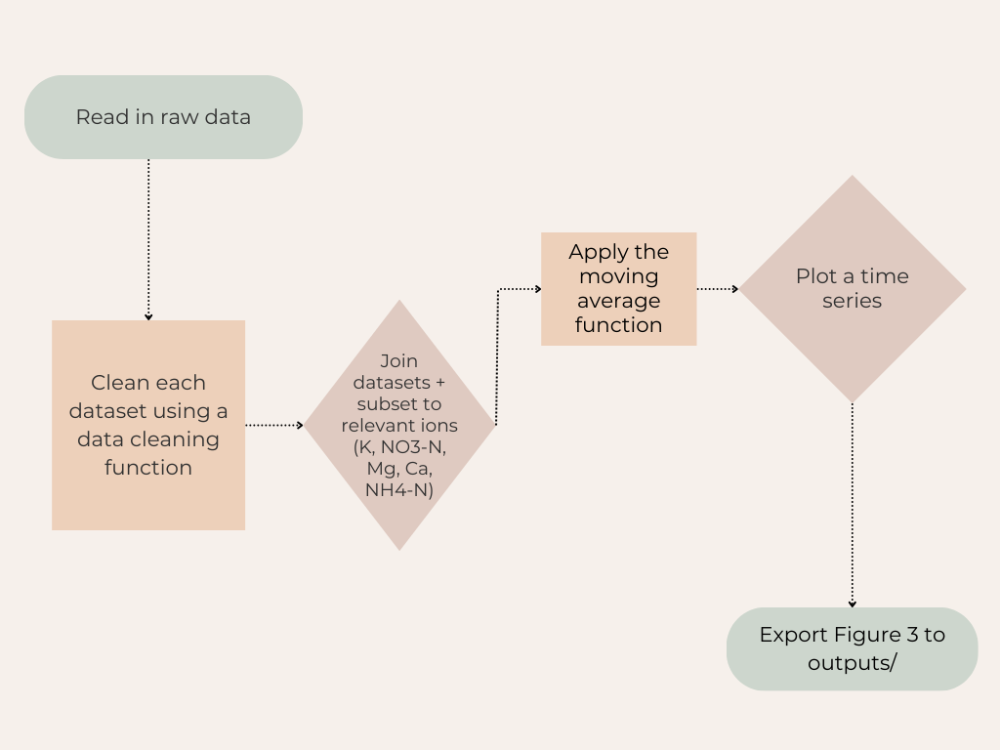

# Hurricane Disturbance and Stream Chemistry

### Project Description

#### This repository aims to reproduce Figure 3 from Schaefer et al. (2000), *Effects of hurricane disturbance on stream water concentrations and fluxes in eight tropical forest watersheds of the Luquillo Experimental Forest, Puerto Rico.* Inside this repository is the code to carry out a time-series analysis for ions in four streams from Puerto Rico after the hurricane disturbance, Hurricane Hugo, in 1989. This work highlights the impact of extreme weather events on stream chemistry and demonstrates reproducible environmental data workflows using R and Quarto.


<p align="center">
  
</p>

### Features

#### - Flowchart for an intuitive understanding of the workflow
#### - Time-series analysis of stream ion concentrations (Mg, K, Ca, NH4-N, NO3-N))
#### - Moving average function to reveal post-hurricane trends
#### - Quarto report to integrate code and visualization
#### - Reproduction of Figure 3 from Schaefer et al. (2000)
#### - Folder structure for reproducible analysis

### Repository Structure
```
- hurricane-streams/
  - analysis/
    - hurricane_analysis.qmd
  - images/
    - fig3.png
    - flowchart.png
  - output/
    -plotted_figure3.png
  - processed_data
    - mpr_clean.csv
    - q1_clean.csv
    - q2_clean.csv
    - q3_clean.csv
  - R/
    - 01_clean_data.R
    - 02_moving_avg.R
    - plotting.R
  - raw_data/
    - QuebradaCuenca1-Bisley.csv
    - QuebradaCuenca2-Bisley.csv
    - QuebradaCuenca3-Bisley.csv
    - RioMameyesPuenteRoto.csv
  - README.html
  - README.md
  - scratch
```

### How to Run the Analysis

#### To run this project, run the following commands:


#### 1. Clone this repository
Create a version-controlled RStudio project by cloning the repository from GitHub. 

#### 2. Install the following packages

Run the following command in the **Console**:
```
source("packages/install_packages.R")
```
#### 3. Render the Quarto document

a. Open ```analysis/hurricane_analysis.qmd```.
b. Click the Render button in the RStudio toolbar.

> This will reproduce Figure 3 and save the output in ```output/```.

### Workflow (Flowchart)

<p align="center">
  
</p>


### Data Access

##### McDowell, William H., and USDA Forest Service. International Institute Of Tropical Forestry (IITF). 2024. “Chemistry of Stream Water from the Luquillo Mountains.” Environmental Data Initiative. https://doi.org/10.6073/PASTA/F31349BEBDC304F758718F4798D25458.

### Author

##### Melannie Moreno Rolón  
##### M.S. Environmental Data Science Candidate  
##### Bren School of Environmental Science & Management, UCSB

### References

> ##### Schaefer DouglasA, McDowell WH, Scatena FN, Asbury CE. Effects of hurricane disturbance on stream water concentrations and fluxes in eight tropical forest watersheds of the Luquillo Experimental Forest, Puerto Rico. Journal of Tropical Ecology. 2000;16(2):189-207. doi:10.1017/S0266467400001358
